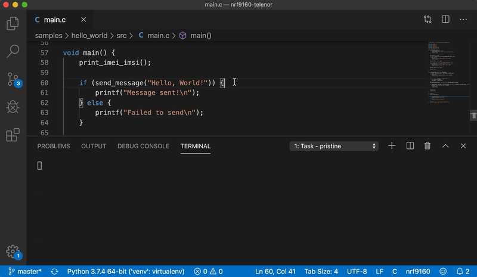
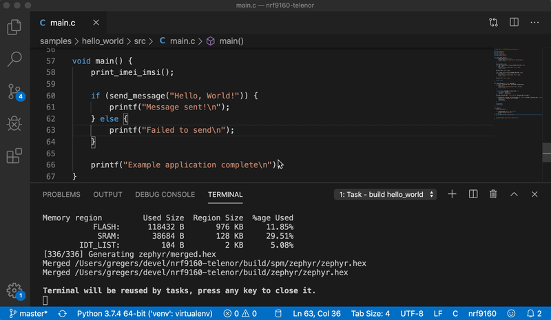

# Telenor nrf9160 samples

This repository includes a few sample applications to help get you started with using the nRF9160 with the [Telenor IoT Gateway][7] which, as of January 2020, is only enabled for Telenor Norway.

**Samples included**
- [hello_world](samples/hello_world) - Get device online and send `Hello, World!`.
- [fota](samples/fota) - Bare bones example of [Firmware Over The Air][8] updates.
- [coap](samples/coap) - CoAP client and server.

## Development Environment

At the time of the writing, concise and reliable instructions for setting up one's development environment were hard to come by. To reduce the barrier of entry into the IoT market, we've tried to simplify the setup process.

Nordic Semiconductors have chosen Zephyr for firmware development on the nRF9160. The build tool for Zephyr relies on python and many pip dependencies. To produce a determnistic build, we've created a Pipfile for [pipenv][1] with
all the pip dependencies from the [different][2] [Zephyr][3] [repositories][4]. Currently it's based on [nRF Connect SDK][5] **v1.1.0**.


You are welcome to follow Nordic's [instructions][6] for setting up the nRF Connect SDK, but we beleive our instuctions are easier and more reliable.

## Prerequisites

* The [nRF9160 DK](https://shop.exploratory.engineering/collections/nb-iot/products/nrf9160-dev-kit) module with Telenor SIM card
* Micro-USB cable
* [nRF Connect for desktop](https://www.nordicsemi.com/Software-and-tools/Development-Tools/nRF-Connect-for-desktop) v3.3.0 (or newer)
    * Install and open the Getting started assistant
    * Follow all the steps in «Install the toolchain»

* [nRF Command Line Tools](https://www.nordicsemi.com/Software-and-tools/Development-Tools/nRF-Command-Line-Tools) v10.5.0 (or newer)

* Install pipenv

    ```sh
        pip3 install pipenv
    ```

* Set environment variables
    * Windows (make sure the path to gnuarmemb is correct)

        ```bat
            setx ZEPHYR_TOOLCHAIN_VARIANT gnuarmemb
            setx GNUARMEMB_TOOLCHAIN_PATH C:\gnuarmemb
        ````
    
    * MacOS

        ```sh
            echo "export ZEPHYR_TOOLCHAIN_VARIANT=gnuarmemb" >> ~/.profile
            echo "export GNUARMEMB_TOOLCHAIN_PATH=/usr/local/opt/gcc-arm-none-eabi" >> ~/.profile
        ```
    
    * Linux

        ```sh
            # depends on your distro
            echo "export ZEPHYR_TOOLCHAIN_VARIANT=gnuarmemb" >> ~/.profile
            echo "export GNUARMEMB_TOOLCHAIN_PATH=/usr" >> ~/.profile
        ```

* MacOS only
    * Install libgit2

        `brew install libgit2`


## Setup MacOS/Linux/Windows

```sh
git clone https://github.com/ExploratoryEngineering/nrf9160-telenor
cd nrf9160-telenor
pipenv install # install python dependencies in projects virtualenv
pipenv run west update # download the Zephyr dependencies using west
```

## Serial terminal application

In order to see the output from the sample applications, follow our tutorial to install a [serial terminal application](https://docs.nbiot.engineering/tutorials/interactive-terminal.html#serial-terminal-application).

## Register your device

Follow the [Getting Started](https://docs.nbiot.engineering/tutorials/getting-started.html) tutorial so that your device can get online.

## Build and debug with Visual Studio Code

TL;DR - you need to run `build <sample name>` before you run the `flash` task. Delete the `build` folder or run `pristine` before building another sample. See why further down.

### Build

1. The default build target is the nRF9160 Development Kit (nrf9160_pca10090ns)

    * If you want to build and upload to another nrf9160-based board, you have to replace `nrf9160_pca10090ns` with the board you'd like to build for in `.vscode/tasks.json`

1. Open the [Command Palette](https://code.visualstudio.com/docs/getstarted/tips-and-tricks#_command-palette) with <key>Ctrl ⇧ P</key> (Win/Linux) or <key>⇧ ⌘ P</key> (Mac)
1. Start typing «`run task`»
1. Select «`Tasks: Run Task`» using arrow keys and hit <key>↵</key>
1. Choose the sample you want to build using arrow keys and hit <key>↵</key>



### Flash to nrf9160

1. First build using the steps above
1. Follow the same steps as above to open the task list
1. Choose `flash` to upload the binary from the build step to the connected nrf9160 DK



### Debug

1. First build and flash one of the samples
1. Set a breakpoint in the source code where you want it to break
1. Press <key>F5</key> - this should open a debugging session (or use the debug tab)
1. The debugger will first stop in `reset.S` before the application is loaded
1. To get to the application code, press <key>F5</key> or the play button to continue executing code
1. The debugger should stop at your breakpoint, and you can step in/out/over, see variables (see note below) and call stack


_Note: The compiler will try to optimize your code, so you'll probably see `<optimized out>` under variables instead of the variable value. To disable the optimizations when debugging, add these lines to the prj.conf:_

```ini
    CONFIG_NO_OPTIMIZATIONS=y
    CONFIG_DEBUG=y
```

We've included configuration to make it possible to build the samples and debug on the nrf9160 from [Visual Studio Code](https://code.visualstudio.com/).

First, let me explain an important feature in West (Zephyrs build tool). When you build an application/sample using west, the output will be in the `build` folder of the current working directory.

Say you've cloned this project into `~/nrf9160-telenor`:
* If you run `pipenv run west build samples/hello_world` from `~/nrf9160-telenor`, the output will be in `~/nrf9160-telenor/build`. It will also store what path you used when building. So if you now just run `west build` without specifying a path, it will still build `hello_world`. If you want to switch sample, you have to [clean the `build/` folder](#clean-build-folder) first.
* If you `cd` into the `samples/hello_world` folder and run `pipenv run west build` there, it will output the build folder to `samples/hello_world/build`.

Both methods work fine, but the [tasks](https://code.visualstudio.com/docs/editor/tasks) we've defined in VS Code always build from the project root folder. Then we only need to duplicate the `build ...` task for each sample, and the `flash` and `debug` assume you've already ran the build task first.

## Tips'n tricks

### Menuconfig

The amount of config options for Zephyr can be quite daunting, but they actually have a command line user interface that allows you to browse the config options interactiely. Either navigate using arrow keys or search using the <key>`/`</key> key. When you find the right options, write down the name and value. Alternatively save a minimal config with the <key>`D`</key> key to a temporary file, then copy the options over to `prj.conf`.

```sh
pipenv run west build -t menuconfig samples/hello_world
```

### pipenv shell

If you get tired of typing `pipenv run` before every `west` command, you can run `pipenv shell` first. This will create a new shell that activates the pipenv virtualenv. Just remember to exit before you us the shell for other things.

## Troubleshooting

### Delete the build folder

Very often when a build fails, some files are left in the `build/` folder which confuses subsequent builds. Try to delete the `build/` folder and build again.

### Clear Zephyr toolchain capability cache

Sometimes when changing dependency versions, the cache can cause build errors.
Deleting it doesn't do any damage, it just increases the build time on the next
build.

    rm -rf ~/Library/Caches/zephyr

[1]: https://pipenv-fork.readthedocs.io/en/latest/
[2]: https://github.com/NordicPlayground/fw-nrfconnect-nrf/blob/master/scripts/requirements.txt
[3]: https://github.com/NordicPlayground/fw-nrfconnect-zephyr/blob/master/scripts/requirements.txt
[4]: https://github.com/NordicPlayground/fw-nrfconnect-mcuboot/blob/master/scripts/requirements.txt
[5]: https://github.com/NordicPlayground/fw-nrfconnect-zephyr
[6]: https://www.nordicsemi.com/Software-and-Tools/Software/nRF-Connect-SDK
[7]: https://nbiot.engineering/
[8]: https://blog.exploratory.engineering/post/something-in-the-air/
