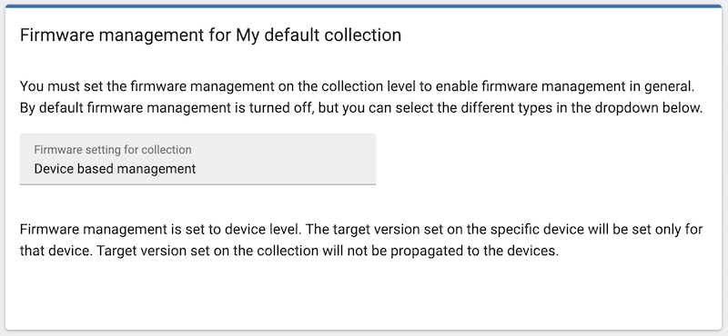
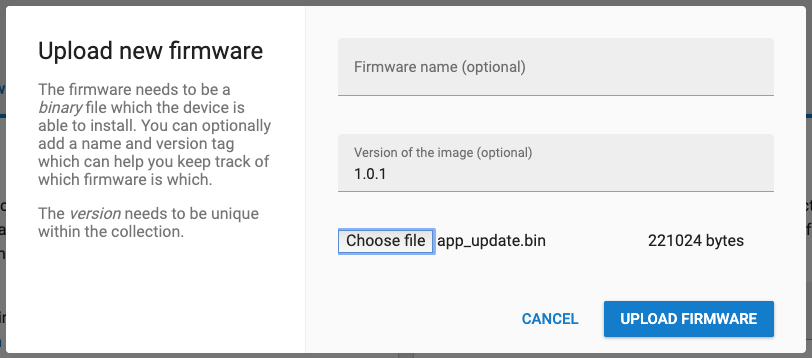
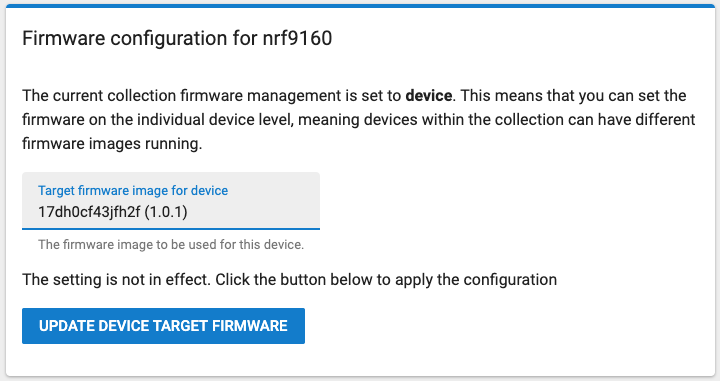
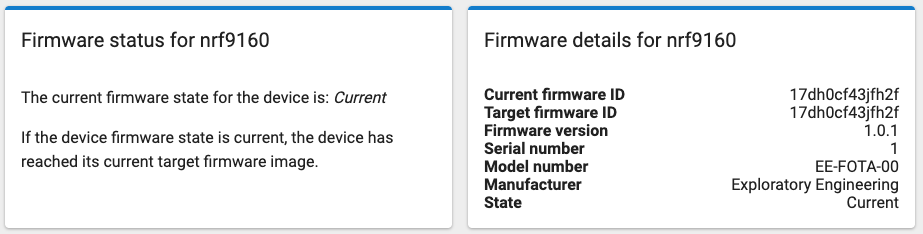

# Firmware over the air (FOTA)

Before deploying a device into the field, you probably want to have a way to update it without someone having to manually get to the device and install a new firmware change. The [Telenor IoT Gateway](https://nbiot.engineering/) has implemented the firmware update part of LwM2M standard to simplify the process of firmware updates. This sample implements the minimum of what you need on the device side to do a firwmare update over the air. Full details of [how to do a firmware update is documented on our blog](https://blog.exploratory.engineering/post/something-in-the-air/).

## Prerequisites

Please make sure you've followed [the instructions in the main README](../../README.md) to set up the build toolchain and register your device.

## Clean build folder

If you've already built another sample, you'll get build errors because the `build/` folder contains files from a different source directory. So we need to clean the `build/` folder before building a different sample.

```sh
# macOS/Linux clean old build folder
rm -rf build # clean the build folder (in case you built hello_world first)

# Windows clean old build folder
rd /s /q build
```

Alternately, you can build each sample in its own directory; then their build folders will not collide.

## Build and run fota

```sh
cd samples/fota
```

First you have to generate a private key for signing the firmware images

```sh
pipenv run imgtool keygen --key cert.pem --type rsa-2048
```

Then we need to generate a few certificates for signing the bootloader

```sh
# generate private keys
openssl ecparam -name prime256v1 -genkey -noout -out mcuboot-priv.pem
openssl ecparam -name prime256v1 -genkey -noout -out mcuboot-priv2.pem

# get public keys from the private keys
openssl ec -in mcuboot-priv.pem -pubout -out mcuboot-pub.pem
openssl ec -in mcuboot-priv2.pem -pubout -out mcuboot-pub2.pem
```

Build the firmware and flash it to the device by running

```sh
pipenv run west build
pipenv run west flash --erase # erase is needed if the signing keys doesn't match the public keys in the OTP
```

_Note: The default board is the nRF9160 Development Kit. If you want to build and upload to another nrf9160-based board, you have to add `-b <board-name>` for the build command above. So to build for the Thingy:91, the command would be: `west build -b nrf9160_pca20035ns samples/fota`_

Now, modify the firmware version on the command line (or by editing [prf.conf](prj.conf)), build again (but don't flash!).

```sh
rm -rf build  # unfortunately necessary, or Zephyr will not see the version change
pipenv run west build -- -DCONFIG_APP_FIRMWARE_VERSION=\"1.0.1\"
```

Login to the [Telenor IoT Gateway](https://nbiot.engineering/) and go to the firmware tab for the collection your device is registered.

1. Choose «Device based management» as _Firmware management_ for the collection.

    

1. Upload the binary you just built (`build/zephyr/app_update.bin`) as version `1.0.1`.

    


1. Go to the devices tab for the collection and choose your device.
1. Under the firmware tab for the device you'll see the current firmware status for the device. Since we haven't uploaded the 1.0.0 firmware to the IoT Gateway, it doesn't know much details about what's running on the device yet.
1. Change the target firmware image to version 1.0.1 and click the «Update device target firmware»-button.

    

The device state should change to *Pending*. A firmware upgrade will be triggered on the device the next time it updates its LwM2M registration — which is every 10 minutes, so in the interest of time you might just reboot the device. After it connects to the network and registers with the LwM2M server, it will start to download the image. Now the device state should change to *Downloading*. A couple minutes later, it will reboot with the new firmware and the state should change to *Current*. Et voilà!



## Bootloader update

Explain:
- Slots
- config
- keys

signed_by_mcuboot_and_b0_s1_image_update.bin
